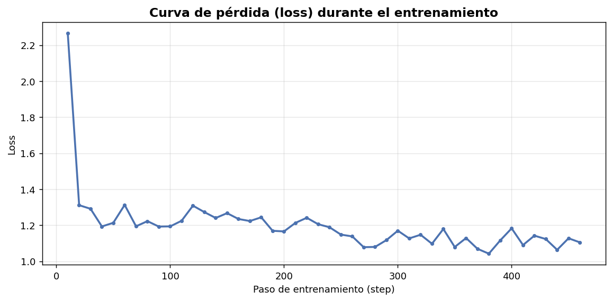

# Clasificador de Sentimiento 

Proyecto que entrena un modelo de lenguaje pequeño para leer tweets en español y decir si son **negativos, neutrales o positivos**. La idea es aprender cómo funciona el *fine-tuning* de un LLM de principio a fin, usando **Qwen2.5-0.5B-Instruct** con las técnicas **SFT + LoRA**.

> Se parte de un modelo que ya existe y se le "enseña" una tarea nueva, viendo todo el proceso: cargar datos, entrenar, probar y medir qué tan bien quedó.

---

## 📋 De qué se trata

| | |
|---|---|
| **Qué hace** | Clasifica el sentimiento de un texto en 3 categorías |
| **Modelo de base** | Qwen2.5-0.5B-Instruct (un modelo "chico", ~500M de parámetros) |
| **Cómo se entrena** | SFT (mostrarle ejemplos) + LoRA (para que el entrenamiento sea liviano) |
| **Datos** | `cardiffnlp/tweet_sentiment_multilingual` (la parte en español) |
| **Herramientas** | HuggingFace Transformers, PEFT, TRL, Weights & Biases, scikit-learn |

---

## 🎯 Qué se logró

El modelo termina acertando el **64.3% de las veces** en una tarea de 3 opciones. Para tener una referencia: si respondiera al azar, acertaría solo ~33%. Así que sí aprendió algo. 🙂

### Cómo fue aprendiendo durante el entrenamiento

La curva de *loss* (error) baja a medida que el modelo entrena: parte alta (~2.27) y se va estabilizando cerca de ~1.1. Que baje y se aplane es justo la señal de que está aprendiendo.

### Resultados en el "examen final" (tweets que nunca vio durante el entrenamiento)

| Clase | Precisión | Recall | F1 |
|---|---|---|---|
| negativo | 0.681 | 0.810 | 0.740 |
| neutral | 0.510 | 0.520 | 0.515 |
| positivo | 0.759 | 0.600 | 0.670 |
| **Acierto general** | | | **0.643** |

**Cómo leer esto:**
- Es **bueno entendiendo lo negativo** (recall 0.81): casi no se le escapa un tweet enojado o triste.
- Es **confiable cuando dice "positivo"** (precisión 0.76): cuando lo marca así, suele tener razón.
- Lo **neutral le cuesta**: es la categoría más confusa (¿un tweet aburrido es neutral o medio negativo?), y ahí es donde más se equivoca. Es algo normal, ya que es algo ambiguo.

---

## 💡 Por qué este enfoque y no otro

Hay varias formas de hacer un clasificador de texto. Estas son las ventajas de esta comparada con otras:

**Comparado con métodos más antiguos (contar palabras, tipo TF-IDF + regresión / SVM):**
- Este modelo **entiende el contexto**. Por ejemplo, capta que "no está nada mal" en realidad es positivo, algo que los métodos de contar palabras suelen confundir.
- **No hay que preparar las palabras a mano** (armar listas, limpiar, etc.); el modelo ya entiende el idioma.

**Comparado con otros modelos tipo BERT / BETO:**
- Lo que se entrena con LoRA es un "accesorio" muy chico (unos pocos MB), no un modelo gigante entero. Es fácil de guardar y compartir.
- El modelo original queda **intacto**, así que **no se le olvida** el español que ya sabía; solo se le suma la habilidad nueva.
- Como es un modelo que sigue instrucciones, después se puede **reusar para otra tarea** solo cambiándole la instrucción, sin volver a armar todo.

**Comparado con usar una IA grande por internet (tipo ChatGPT):**
- Es **propio y funciona local**: los datos no salen a ningún lado y no se paga por cada uso.
- Responde rápido y no depende de internet ni de límites de uso de otra empresa.

**Y lo más práctico:**
- Con LoRA se entrena menos del **1% del modelo**, así que ocupa mucho menos cómputo y memoria que entrenarlo entero.

---

## 🧠 ¿Qué es LoRA y por qué se usó?

Entrenar un modelo "completo" significa modificar sus 500 millones de parámetros, y eso pide muchísima memoria. **LoRA (Low-Rank Adaptation)** es un truco para evitarlo: en vez de tocar el modelo entero, lo **congela** y le pega al lado unas matrices chiquitas que son las únicas que aprenden la tarea nueva. Resultado: se entrena mucho menos pero igual funciona.

Estos son los ajustes que se usaron:

| Ajuste | Valor | Qué significa (en simple) |
|---|---|---|
| `r` | 8 | El "tamaño" del accesorio que aprende. Más grande = más capacidad, pero más pesado |
| `lora_alpha` | 16 | Cuánto pesa ese accesorio sobre el modelo original |
| `lora_dropout` | 0.05 | Apaga un 5% al azar mientras entrena, para que no "se aprenda de memoria" los ejemplos |
| `target_modules` | `all-linear` | Le pone el accesorio a todas las capas internas, no solo a algunas |

---

## 🚀 Cómo usarlo

Abre el notebook en Google Colab (botón *Open in Colab* de arriba) y ejecuta las celdas en orden:

1. **Instalar** las librerías.
2. **Cargar los datos** (tweets en español ya etiquetados).
3. **Darle formato** a cada tweet como una pregunta → respuesta.
4. **Entrenar** con LoRA.
5. **Probarlo** escribiendo frases sueltas (`predecir("...")`).
6. **Medir** qué tan bien quedó (acierto, precisión, recall, F1).
7. **Ver la matriz de confusión** para entender en qué se equivoca.

---

## 🔭 Qué se podría mejorar más adelante

- Entrenarlo durante más tiempo (más épocas).
- Probar con un modelo de base más grande.
- Conseguir más datos.
- Trabajar especialmente la categoría **neutral**, que es la que más se le complica.

---

## 📚 Herramientas usadas

`Python` · `PyTorch` · `HuggingFace Transformers` · `PEFT (LoRA)` · `TRL` · `Weights & Biases` · `scikit-learn` · `matplotlib`
